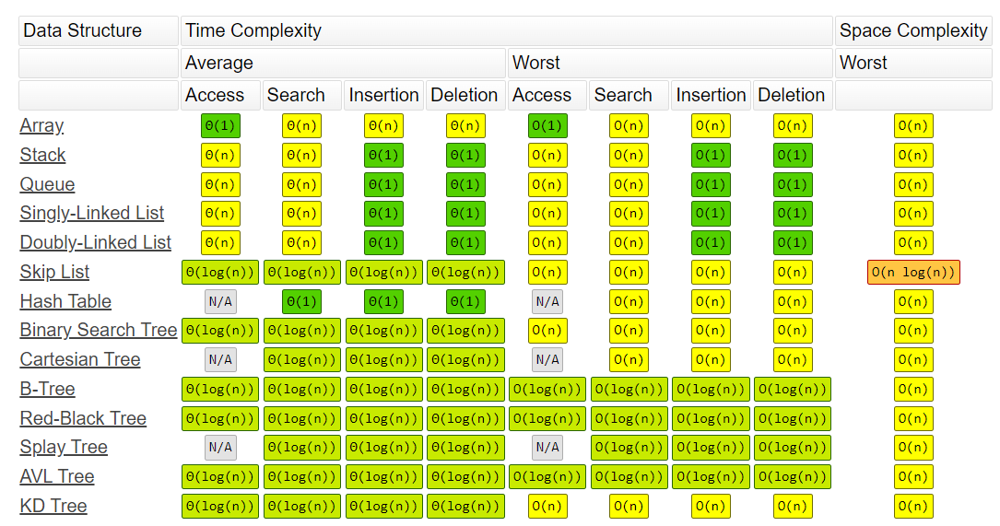
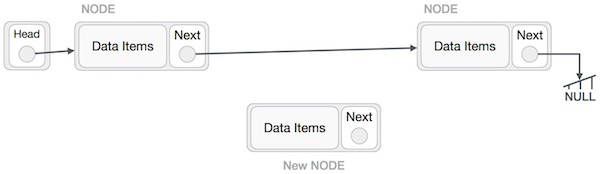

# linked list

### Big (O)
---
- Big O notation is a mathematical notation that describes the limiting behavior of a function when the argument tends towards a particular value or infinity
 - big O notation is used to classify algorithms according to how their run time or space requirements 
 Big O notation has two main areas of application:

In mathematics, it is commonly used to describe how closely a finite series approximates a given function, especially
  - in the case of a truncated Taylor series or asymptotic expansion
- In computer science, it is useful in the analysis of algorithms
In both applications, the function g(x) appearing within the O(·) is typically chosen to be as simple as possible, omitting constant factors and lower order terms.
 
 

 ### linked list
 ---
 A linked list is a linear data structure, in which the elements are not stored at contiguous memory locations. The elements in a linked list are linked using pointers as shown in the below image:


 The simplest form of linked lists — a singly linked list — is a series of nodes where each individual node contains both a value and a pointer to the next node in the list.

Additions (Add) grow the list by adding items to the end of the list.

Removals (Remove) will always remove from a given position in the list.

Search (Contains) will search the list for a value.

Example use cases:
- Storing values in a hash table to prevent collisions (more on this in a few posts)
- Remaking the amazing race!


#### Insertion Operation
Adding a new node in linked list is a more than one step activity. We shall learn this with diagrams here. First, create a node using the same structure and find the location where it has to be inserted.



Imagine that we are inserting a node B (NewNode), between A (LeftNode) and C (RightNode). Then point B.next to C −
```
NewNode.next −> RightNode; 
```


This will put the new node in the middle of the two. The new list should look like this −

.jpg)
Similar steps should be taken if the node is being inserted at the beginning of the list. While inserting it at the end, the second last node of the list should point to the new node and the new node will point to NULL.