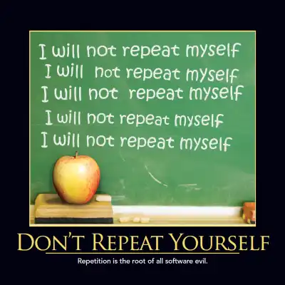

# OOPs | Object Oriented Design

### The Don't Repeat Yourself (DRY)
 principle states that duplication in logic should be eliminated via abstraction; duplication in process should be eliminated via automation. Duplication is Waste. Adding additional, unnecessary code to a codebase increases the amount of work required to extend and maintain the software in the future.  Duplicate code adds to technical debt.  Whether the duplication stems from Copy Paste Programming or poor understanding of how to apply abstraction, it decreases the quality of the code.  Duplication in process is also waste if it can be automated.  Manual testing, manual build and integration processes, etc. should all be eliminated whenever possible through the use of automation.

### rule of three

It states that two instances of similar code do not require refactoring, but when similar code is used three times, it should be extracted into a new procedure. The rule was popularised by Martin Fowler in Refactoring and attributed to Don Roberts.
Some important points to know about OOP: 
 

OOP treats data as a critical element. 
 
Emphasis is on data rather than procedure. 
 
Decomposition of the problem into simpler modules. 
 
Doesn’t allow data to freely flow in the entire system, ie localized control flow. 
 
Data is protected from external functions. 
 
Advantages of OOPs – 
 

It models the real world very well. 
 
With OOP, programs are easy to understand and maintain. 
 
OOP offers code reusability. Already created classes can be reused without having to write them again. 
 
OOP facilitates the quick development of programs where parallel development of classes is possible. 
 
With OOP, programs are easier to test, manage and debug. 
 
Disadvantages of OOP – 
 

With OOP, classes sometimes tend to be over-generalized. 
 
The relations among classes become superficial at times. 
 
The OOP design is tricky and requires appropriate knowledge. Also, one needs to do proper planning and design for OOP programming. 
 
To program with OOP, the programmer needs proper skills such as design, programming, and thinking in terms of objects and classes, etc. 
 