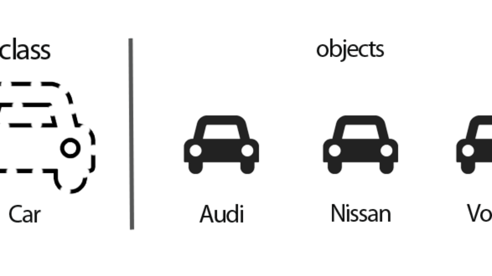

## OOP reading/exampels

Java is an Object Oriented language as it is modeled and organized around objects rather than actions; and data rather than logic. It simplifies software development and maintenance by providing some very intriguing features. Object-Oriented Programming in Java aims to implement real-world entities such as objects, classes, abstraction, inheritance, polymorphism, and many more.

---

### Java Classes:
A class in Java  includes all your data.  A class contains fields (variables) and methods to describe the behavior of an object.
``` 
class Test {
       member variables // class body
       methods
}
```
---
### Java Objects:
An object is a element in a class which has a  behavior. It is an instance of a class which can access your data. The "new" keyword is used to create the object.
```
//Declaring and Initializing an object
 Test t = new Test();
```
---
### object and class
***thats how obeject and class look in reallife***


### here is agood example :
```
public class CarTest {
    
    public static void main(String[] args) {
        // create new Audi car
        Car audi = new Car("Audi");
        // create new Nissan car
        Car nissan = new Car("Nissan");
        
        // print current speed of Audi - it is 0 
        audi.printCurrentSpeed();
        
        // call the accelerate method twice on Audi
        audi.accelerate();
        audi.accelerate();
        
        // call the accelerate method once on Nissan
        nissan.accelerate();
        
        // print current speed of Audi - it is now 20 mpH
        audi.printCurrentSpeed();
        // print current speed of Nissan - it is 10 mpH
        nissan.printCurrentSpeed();
        
        // now park the Audi car
        audi.park();
        
        // print current speed of Audi - it is now 0, because the car is parked
        audi.printCurrentSpeed();
    }
}
```

## Number Systems — Decimal, Binary and Hexadecimal
---
let me share with you away with three ruls with thie way we can write any numper in  Decimal, Binary and Hexadecimal:

**first read these three point :**
* .Base 10 (Decimal) — Represent any number using 10 digits [0–9]
* .Base 2 (Binary) — Represent any number using 2 digits [0–1]
* .Base 16(Hexadecimal) — Represent any number using 10 digits and 6 characters [0–9, A, B, C, D, E, F]

We all know how to write numbers up to 9 it’s simple. When you have used up all of your symbols, what you do is,
* you add another digit to the left and make the right digit 0.

* Then again go up to until you finish up all your symbols on the right side and when you hit the last symbol increase the digit on the left by 1.
* When you used up all the symbols on both the right and left digit, then make both of them 0 and add another 1 to the left and it goes on and on like that.
* If you use the above 3 rules on a decimal system,
Write numbers 0–9.
* Once you reach 9, make rightmost digit 0 and add 1 to the left which means 10.
* Then on right digit, we go up until 9 and when we reach 19 we use 0 on the right digit and add 1 to the left, so we get 20.
Likewise, when we reach 99, we use 0s in both of these digits’ * places and add 1 to the left which gives us 100.
* So you see when we have ten different symbols, when we add digits to the left side of a number, each position is going to worth 10 times more than it’s previous one.
 