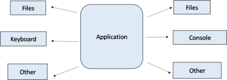
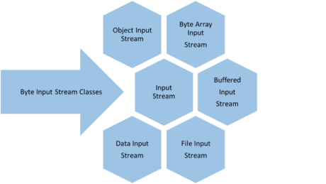
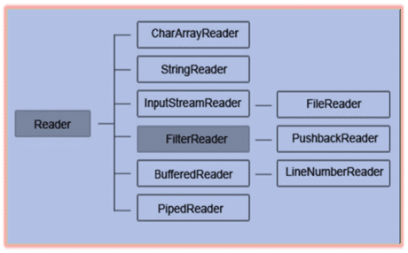
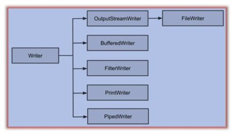

## Java File Handling(i/o)
---


The File class from the java.io package, allows us to work with files.

To use the File class, create an object of the class, and specify the filename or directory name.
 
 example:
 ``` import java.io.File; File myObj = new File("filename.txt");```

 ***The File class has many useful methods for creating and getting information about files. For example:***

|Method|  	Type|	        Description|
|:---:|:---:|:---:|
|canRead()|	Boolean|	      Tests whether the file is readable or not|
|canWrite()|	Boolean|	   Tests whether the file is writable or not|
|createNewFile()|Boolean|	Creates an empty file|
|delete()|	Boolean|	Deletes a file|
|exists()|	Boolean|	Tests whether the file exists|
|getName()|	String|	Returns the name of the file|
|getAbsolutePath()|	String|	|Returns the absolute pathname of the file|
|length()|	Long| Returns the size of the file in bytes|
|list()|	String[]|	Returns an array of the files in the directory|
|mkdir()|	Boolean|	Creates a directory|

### for more iformation take a look to this photos :-)


***Byte Input Stream:***
- These are used to read byte data from various input devices.
- InputStream is an abstract class and it is the super class of all the input byte streams.
List of Byte Input Streams:

- These are used to read char data from various input devices.
- Reader is an abstract class and is the super class for all the character input streams.
List of Character Input Streams:

***Character Output Stream:***
- These are used to write char data to various output devices.
- Writer is an abstract class and is the super class of all the character output streams.
List of Character Output Stream:

### How to read file in Java using Scanner Example - text files
---
In this Java program, we have used java.util.Scanner to read file line by line in Java. We have first created a File instance to represent a text file in Java and then we passed this File instance to java.util.Scanner for scanning. 

The scanner provides methods like hasNextLine() and readNextLine() which can be used to read file line by line. It's advised to check for next line before reading next the line to avoid NoSuchElementException in Java.  

Here is the complete code example of using Scanner to read text files in Java :


import java.io.File;
import java.io.FileNotFoundException;
import java.util.Scanner;


 *
 * Java program to read files using Scanner class in Java.
 * java.util.Scanner is added on Java 5 and offers a convenient method to read data
 *
 
 ```
public class ScannerExample {

    public static void main(String args[]) throws FileNotFoundException {
 
        //creating File instance to reference text file in Java
        File text = new File("C:/temp/test.txt");
     
        //Creating Scanner instance to read File in Java
        Scanner scnr = new Scanner(text);
     
        //Reading each line of the file using Scanner class
        int lineNumber = 1;
        while(scnr.hasNextLine()){
            String line = scnr.nextLine();
            System.out.println("line " + lineNumber + " :" + line);
            lineNumber++;
        }      
   
    } 
 ```

***sourc***

[Read more](https://www.java67.com/2012/11/how-to-read-file-in-java-using-scanner-example.html#ixzz7MKK02400)

[Read more](https://www.java67.com/2012/11/how-to-read-file-in-java-using-scanner-example.html#ixzz7MKJjGHNS)


